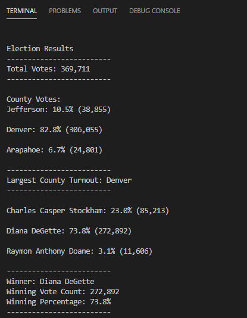

# Election Analysis

## Overview of Election Audit
Seth and Tom, employees of the Colorado Board of Elections, have given me the task of executing an election audit for the local congressional election. With their guidance, I will use python to create a report that iterates through the rows of data, write a script to perform calculations, and compose a script that outputs the results into a legible text file.
### Purpose
I will use python to read and analyze nearly 370,000 rows of election data. This powerful tool will calculate and present the following results:
+ The voter turnout for each county.
+ The percentage of votes from each county out of the total count.
+ The county with the highest turnout.
+ The total number of votes cast.
+ Present a list of candidates who received votes.
+ The total number of votes each candidate won.
+ Determine the winner of the election based on popular vote.

## Resources
+ **Data Source:** election_results.csv
+ **Software:** Python 3.6.1, Visual Studio Code, 1.38.1

## Election-Audit Results
### Candidate Outcomes
The congressional election had a total of three candidates running for office. Three candidates are Charles Stockham, Diana DeGette, and Raymon Doane.
+ This congressional election had a total of 369,711 votes.
+ Charles Stockham recieved 85,213 votes. This is 23% of the total votes.
+ Diana DeGette received 272,892 votes. This is 73.8% of the total votes.
+ Raymon Doane received 11,606 votes. This is 3.1% of the total votes.

**Diana Degette is the winner of the election.** She received 73.8% of the popular vote. A total of 272,892 votes.

Code breakdown of the candidate votes and percentage 

 

	# 1. For each row in the CSV file.
    for row in reader:

        # Add to the total vote count
        total_votes = total_votes + 1

        # Get the candidate name from each row.
        candidate_name = row[2]

        # If the candidate does not match any existing candidate add it to
        # the candidate list
        if candidate_name not in candidate_options:

            # Add the candidate name to the candidate list.
            candidate_options.append(candidate_name)

            # And begin tracking that candidate's voter count.
            candidate_votes[candidate_name] = 0

        # Add a vote to that candidate's count
        candidate_votes[candidate_name] += 1
        
   	# 2. Save the final candidate vote count to the text file.
    for candidate_name in candidate_votes:

        # Retrieve vote count and percentage
        votes = candidate_votes.get(candidate_name)
        vote_percentage = float(votes) / float(total_votes) * 100
        candidate_results = (
            f"{candidate_name}: {vote_percentage:.1f}% ({votes:,})\n")

        # Print each candidate's voter count and percentage to the
        # terminal.
        print(candidate_results)

In this code, I am telling the computer to iterate through each row in the CSV file. Each row has a total of one vote. As the computer goes through each row, it will add one vote to the total tally of votes. As it iterates through each row, it observes each candidate's name in the third index. If the candidate name is new, add it to the candidate name list. I set each candidate's votes to zero, then tell the computer to add a tally for each candidate's name it comes across. Finally, I calculate the vote percentage for each candidate and write a script to display each candidate's results.

### County Outcomes
Three counties accounted for the total votes: Jefferson County, Denver County, and Arapahoe County.
+ Jefferson County accounted for 38,855 votes. This is 10.5% of the total votes.
+ Denver County accounted for 306,055 votes. This is 82.2% of the total votes.
+ Arapahoe County accounted for 24,801 votes. This is 6.7% of the total votes.

**Denver County is the county with the largest voter turnout.** Denver County is the county with the largest voter turnout. Denver County had 306,055 people vote. This county accounts for 82.8% of the total voters.

Code breakdown of the county votes and percentage 

 

 	# 3: Extract the county name from each row.
        county_name = row[1]
    # 4a: Write a decision statement that checks that the
        # county does not match any existing county in the county list.
        if county_name not in county_options:

            # 4b: Add the existing county to the list of counties.
            county_options.append(county_name)

            # 4c: Begin tracking the county's vote count.
            county_votes[county_name] = 0

        # 5: Add a vote to that county's vote count.
        county_votes[county_name] += 1
       
       # 6a: Write a repetition statement to get the county from the county dictionary.
    for county_name in county_options:
        # 6b: Retrieve the county vote count.
        countyvotes = county_votes[county_name]
        # 6c: Calculate the percent of total votes for the county.
        countyvote_percentage = float(countyvotes) / float(total_votes) * 100
        county_results = (f"{county_name}: {countyvote_percentage:.1f}% ({countyvotes:,})\n")
         # 6d: Print the county results to the terminal.
        print(county_results)
         # 6e: Save the county votes to a text file.
        txt_file.write(county_results)
         # 6f: Write a decision statement to determine the winning county and get its vote count.
        if (countyvotes > county_count) and (countyvote_percentage > largest_county_percentage):
            county_count = countyvotes
            winning_county = county_name
            largest_county_percentage = countyvote_percentage

    # 7: Print the county with the largest turnout to the terminal.
    largest_county_summary = (
        f"-------------------------\n"
        f"Largest County Turnout: {winning_county}\n"
        f"-------------------------\n")
    print(largest_county_summary) 

        

In this code, I am telling the computer to iterate through each row in the CSV file. As it iterates through each row, it observes each county's name in the second index. If the county name is new, add it to the county name list. I set each county's votes to zero, then tell the computer to add a tally for each county's name it comes across.  I conduct a series of calculations to find the vote percentage for each county. Finally,  I write a script to display each county's results.

## Election-Audit Summary

This report shows how quickly Python can read and analyze through large volumes of data. Python iterated through nearly 370,000 rows of data and presented the results within a matter of seconds. With some modifications, this language can further enhance the report to reflect a more in-depth view of the data.

One suggestion I'd make is to track data in real-time, or as close to real-time as possible. Using matplotlib and pandas, graphs and maps can be used to display live election results as more data is entered and refreshed into the local machine. This will give the Board of Elections and the public live results on the county and candidate votes. We saw an example of this in the most recent 2020 election. Media and election analysts used the live map representations of voting results per county. We saw analysts explain how the outcome of each county could affect the popular vote for the state. People were eager to know the results. These visualizations and live analyses made it a bit easier for people to predict the election as more votes were counted and reported.

The last suggestion is collecting another column of data, such as vote date. It was predicted this past election that early voters tended to be Democratic voters. This prediction is based on the current president's views on mail-in ballots and early voting. Using the vote date, ballot ID, and candidate name, a script can be run to calculate if early voters accounted for a majority percentage of votes towards one candidate. A script can also be run to calculate which voting method had the largest amount of participants. Would it be early voting methods or election day voting?
